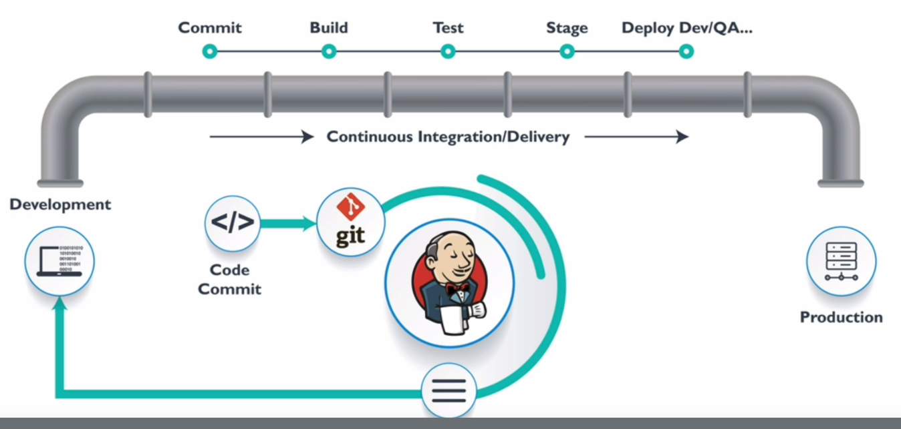
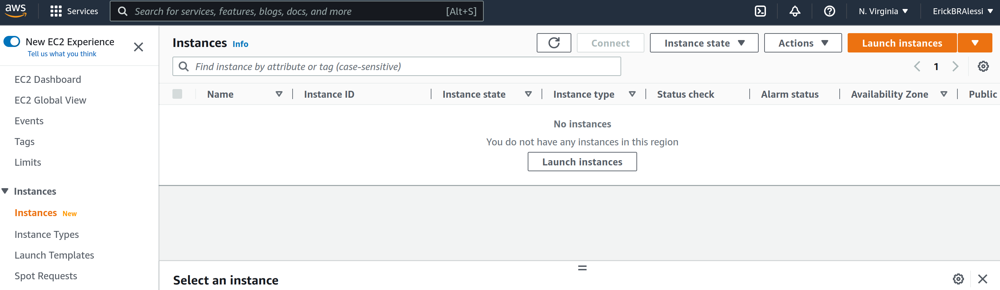
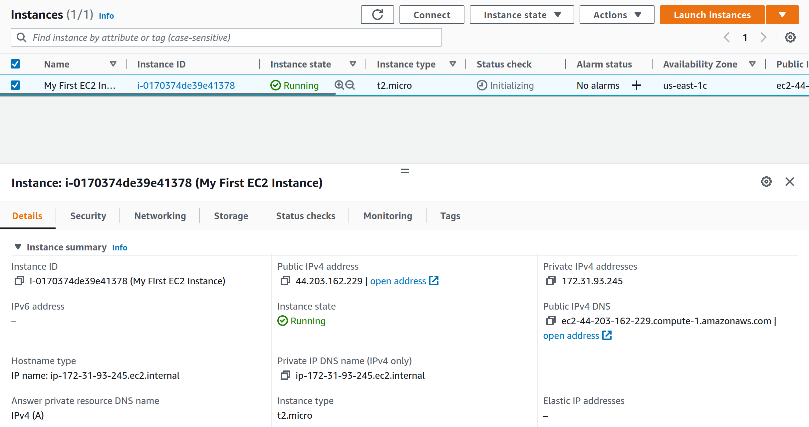
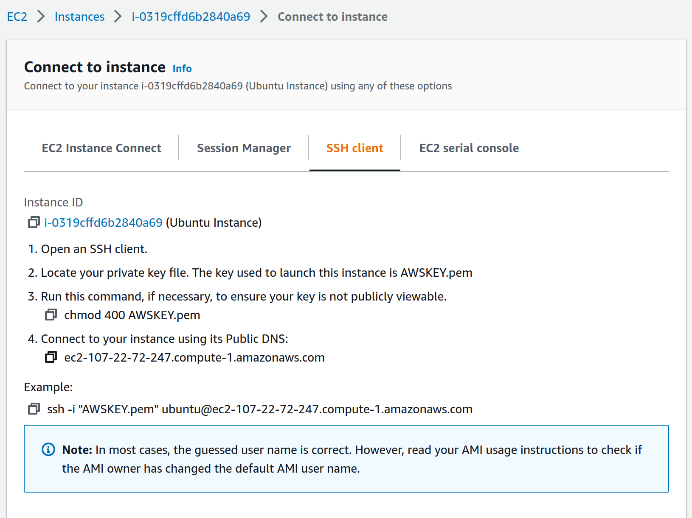

# Devops Tools Study

## S01 - Introduction
It is the artifacts generated from the course `Devops Tools and Aws for Java Microservice Developers` that can be found at the link on [Udemy](https://www.udemy.com/course/devops-tools-and-aws-for-java-microservice-developers/)

The course is composed of 31 sections:
* S01 - Introduction
* S02 - Fundamentals
* S03 - AWS EC2 and Linux Basics
* S04 - GIT
* S05 - Maven
* S06 - Software for Microservices Development
* S07 - Create or Downloading Spring Boot Microservices Projects
* S08 - Manual Deployment to AWS using EC2 using S3
* S09 - AWS Elastic Load Balancer
* S10 - AWS Autoscaling Group
* S11 - AWS Cloudwatch Monitoring and SNS 
* S12 - Deploy to AWS Elastic Beanstalk using RDS
* S13 - Docker
* S14 - Dockerize Micro Services
* S15 - Docker Compose
* S16 - Kubernetes Concepts and Local Setup
* S17 - Kubernetes in action
* S18 - Kubernetes Volumes
* S19 - Deploying Microservices to Kubernetes
* S20 - Eclipse JKube Quick Start
* S21 - Docker Swarm
* S22 - Jenkins: Continuous Deployment
* S23 - Jenkins: Pipelines
* S24 - AWS IAM Service
* S25 - AWS CLI Quick Start
* S26 - AWS Lambda Quick Start
* S27 - Ansible-Configuration Management
* S28 - Microservice Creation Assignment Solution
* S29 - Docker Assignment Solution
* S30 - Docker Compose Assignment Solution
* S31 - Wrap Up

## S02 - Fundamentals
### What are Microservices?
Microservices are the Monolithic antagonist. Instead of a huge system having all the modules necessary for a system in the same application, microservices split the monolithic system in many ***small, focussed and autonomous*** microsystems which communicate to each other though APIs (network calls). 
### Why Microservices?
The main characteristics that make using microservices interesting are:
1. Heterogeneous: you can run different microservices on different platforms, using different programming languages and databases.
2. Robustness: if one component of the system fails, it can still run without this functionality.
3. Scalable: you can add resources for one or another microservices individually as it's needed.
4. Easy to deploy: you don't need to redeploy the entire project to add functionalities.
5. Reusable: a service can be used by more than one application 
6. Replaceable: you can replace one of the microservices with another one since it keeps the same API.
### What is Cloud Computing?
All the infrastructure that were needed to keep an application online, like storage, networking, security, scaling, load balancing can now be supplied online: ***on demand, ubiquitous, over the network and shared***. It means that we will just pay for what are being used, being able to access it from anywhere over the network and resources can be shared between applications.

There are many clouds, like AWS, Azure, GCP, Oracle, IBM etc. We could create our own cloud, but the advantage of using a cloud service is that no initial capital is needed, it's already done.
### Types of Cloud
There are 3 types of cloud:
1. Public: open for all, anyone can create an account and use it.
2. Private: when an organization create and maintain its own cloud.
3. Hybrid: when you have mixed clouds being used, it can be like `public-public`, `public-private`.
### Service Models
To be able to run an application we need to provide several resources. Depending on which of these resources are provided by the service, we have a different service model.

It can be an Infrastructure as a Service (IaaS), Platform as a Service (PaaS) and Software as a Service (SaaS), the following list writes down which resources each of these models provides.
* Application
* Data (SaaS)
* Runtime (SaaS, PaaS)
* Middleware (SaaS, PaaS)
* Operating System (SaaS, PaaS)
* Virtualization (SaaS, PaaS, IaaS)
* Services (SaaS, PaaS, IaaS)
* Storage (SaaS, PaaS, IaaS)
* Networking (SaaS, PaaS, IaaS)
### AWS - Amazon Web Services
The AWS provides a lot of resources, but the basic needs and its AWS implementations are:
* Environment - EBS (Elastic Beanstalk)
* Security - IAM/Security Groups
* Load Balancing - ELB (Elastic Load Balancer)
* Scaling - Auto Scaling
* Health Checks and Monitoring - Cloud Watch
### CI/CD - Continuous Integration - C. Delivery - C. Deployment
Continuous Integration goes from commit until build stage, while the Continuous Delivery goes until Stage environment (deploys on test or development environment), while Continuous Deployment goes one step further, it goes until production deployment.

### Devops
Devops is a process that we follow to enable CI and CD. For each step we can use several tools, but the most popular for each are described by the following table:

| Source | Build   | Test      | Deploy         | Monitor     |
|--------|---------|-----------|----------------|-------------|
| GIT    | Maven   | Container | WAR/JAR        | Cloud Watch |
| Docker | Image   | WAR/JAR   | Container      | Prometheus  |
|        | WAR/JAR |           | Kubernetes/EBS |             |

And Jenkins is the tools that will integrate all these tools.

## S03 - AWS EC2 and Linux Basics
### Creating AWS Account
Go to [AWS Portal](https://portal.aws.amazon.com/billing/signup#/start/email) and follow the instructions for creating a free account.

After having a created account you can [log in](https://console.aws.amazon.com/console/home?nc2=h_ct&src=header-signin) on the console.

### AWS Regions and Zones
AWS is divided in Regions like USA West, Europe etc, and each region is divided in zones, like North Virginia and Ohio. 
These zones are interconnected, so if one of them goes down the other will be able to handle the load.

AWS even has edge location for reducing delay, these edge locations create cache of the request, being able to reduce the latency.

Although developers do not interact directly with the regions and zones, they should be aware of it. 

### EC2 - Elastic Cloud Compute
It as AWS service that use virtual machines (instances) to run our applications on them. 

The EC2 uses the ***AMI (Amazon Machine Image)***. An AMI are templates that contains the software configuration 
(OS, Application Server, and Applications) required to launch your instance. So once you pick AMI launch this instance you can connect to them from anywhere on the internet.
So on Windows you can access it through Putty tool or through SSH on linux terminals. 

Everytime you start an instance it will be given a **different** DNS address (which can be used from anywhere on internet),
if it's needed a static IP you can use an ***Elastic IP*** which you will be charged for.  

### Launch a EC2 Instance
It's a 8 steps process, but first go to the 
EC2 Dashboard > Instances > Launch Instances

1. Pick a name
2. Choose an OS Image
3. Choose An Instance Type (processor, memory, etc)
4. Network Settings
5. Configure Storage
6. Advanced details
7. Summary

After launch, you should have something like this, note that there is no Elastic Ip attributed to it, however you can 
still access it from the using the public address, which changes sometimes. You can find out more about Elastic IP on
[docs](https://docs.rightscale.com/cm/dashboard/clouds/aws/ec2_elastic_ips.html).

### SSH - Secure Shell
You can access the machine through the SSH protocol, that enables secured communication between any two machines on the
network. This communication occurs over the port 22 using a public-private key pair.

You can manually generate a key running the command `ssh-keygen -t rsa` the created key will be kept in the .ssh/id_rsa 
folder.

Although you can click on the *connect* and choose *SSH* it will give you detailed instructions on how to proceed.

After connect you can run the command `sudo -i` changing to the root user.

To disconnect you can run the command `exit`.

### EC2 Tips
You can use a ***top*** command aws will not terminate your session.

You can delete an instance going to the EC2 dashboard and click on ***terminate***

You have a limit of 30gb storage and 750 hours/month, so stop the instances when you are not using it.

